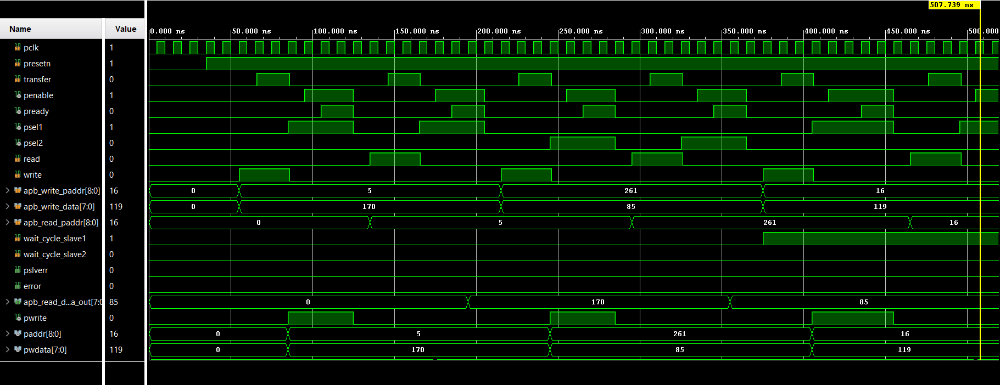
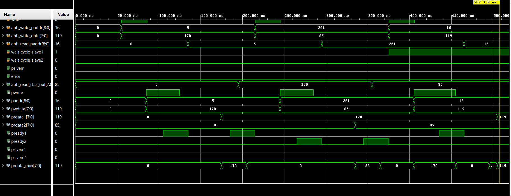
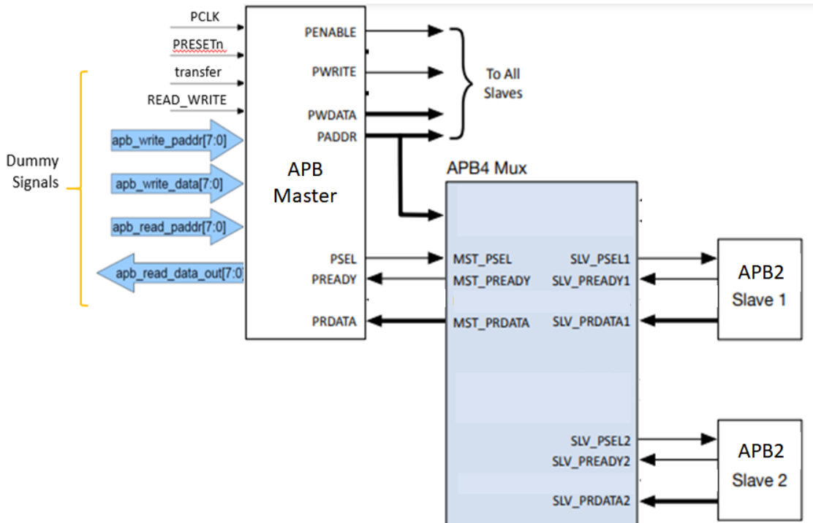
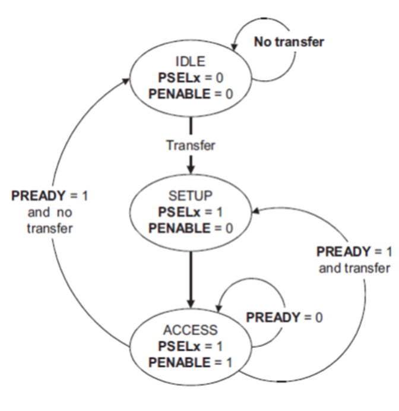

# 🔌 AMBA APB Protocol — Verilog Design & SystemVerilog Verification

A simple **AMBA APB (Advanced Peripheral Bus)** implementation designed in **Verilog** and verified using a **SystemVerilog testbench with assertions** in **Vivado XSim**.

The project demonstrates APB transactions between a master and **two slaves**, including normal transfers, wait states, read/write operations, address decoding, boundary cases, and protocol verification.

## 📌 What is APB?

APB is a simple, low-power bus protocol commonly used to connect a processor/system bus to lower-speed peripherals.

### Simple analogy

Think of APB like a **reception desk**:

1. The master first tells the receptionist which room it wants to visit — **SETUP phase**.
2. The request is then activated — **ACCESS phase**.
3. If the room is not ready, the receptionist asks you to wait using `PREADY`.
4. Once the operation finishes, the transaction ends.

```text
             APB Master
                 │
       ┌─────────┴─────────┐
       │                   │
       ▼                   ▼
   APB Slave 1         APB Slave 2
```

## 🔄 APB Transfer

Each transfer has two main phases:

```text
IDLE → SETUP → ACCESS → IDLE
             │
             ├── PREADY = 1 → Transfer complete
             │
             └── PREADY = 0 → Wait state
```

### SETUP Phase
- `PSEL` is asserted.
- Address and control information are placed on the bus.
- `PENABLE` remains low.

### ACCESS Phase
- `PENABLE` becomes high.
- The selected slave performs the read/write.
- `PREADY` indicates when the transfer is complete.
- `PSLVERR` indicates an error when applicable.

## 🧩 Main Signals

| Signal | Purpose |
|---|---|
| `PCLK` | APB clock |
| `PRESETn` | Active-low reset |
| `PADDR` | Address |
| `PWRITE` | Read/write control |
| `PWDATA` | Write data |
| `PRDATA` | Read data |
| `PSEL` | Slave select |
| `PENABLE` | Access-phase indicator |
| `PREADY` | Transfer completion / wait control |
| `PSLVERR` | Transfer error indicator |

## ⚙️ Project Features

- APB master/slave transaction flow
- Two APB slaves with address-based selection
- Read and write operations
- Transfers with and without wait states
- Address boundary testing
- Invalid-address/error testing
- Multiple consecutive writes and readback
- Overwrite verification
- SystemVerilog assertions for protocol checking
- Self-checking testbench with scoreboard
- Waveform-based verification using Vivado XSim

## 🧪 Verification

The testbench contains multiple verification layers and checks both **functional correctness** and **APB protocol behavior**.

The SystemVerilog verification environment checks important APB properties such as:

1. **PENABLE must only be asserted for a selected slave (`PSEL`).**
2. **The APB control/address information must remain stable during an active transfer, including wait states.**
3. **A transfer must remain in the ACCESS phase until `PREADY` indicates completion.**

These assertions help detect protocol violations that may not be visible from a simple read/write scoreboard.

## 📊 Simulation Results

The testbench executed **14 functional tests** covering:

- Slave 1 read/write
- Slave 2 read/write
- Transfers with wait states
- Multiple writes and readback
- Data overwrite
- Valid boundary addresses
- Invalid addresses
- Read operations with wait states

### Result Summary

```text
Total tests      : 14
Scoreboard PASS  : 18
Scoreboard FAIL  : 2
```

The **18 passing checks** confirm the expected read/write behavior across the tested valid transactions.

The **2 failed checks correspond to the invalid-address `PSLVERR` tests**:

```text
TEST 6: Invalid addr Slave1
        PSLVERR expected → error flag NOT set

TEST 7: Invalid addr Slave2
        PSLVERR expected → error flag NOT set
```

So the current simulation successfully demonstrates the main APB transaction flow, while the two invalid-address cases identify an area where the error-generation logic can be improved.

### Waveform 1



### Waveform 2



## 📐 Design & Verification Diagrams

### APB Protocol Diagram



### APB State Diagram



## 📁 Repository Structure

```text
├── Output/
│   ├── APB_State_diagram.png
│   ├── APB_diagram.png
│   ├── apb_1.png
│   └── apb_2.png
│
├── RTL Design/
│   └── Verilog design files
│
├── Testbench/
│   └── SystemVerilog testbench & assertions
│
├── LICENSE
└── README.md
```

## 🛠️ Tools & Technologies

**Verilog · SystemVerilog · SVA · Vivado 2025.1 · XSim**

## 🎯 What This Project Demonstrates

This project combines **RTL design and verification** rather than only implementing a bus interface.

It demonstrates the complete flow:

```text
APB Specification
       ↓
Verilog RTL Design
       ↓
SystemVerilog Testbench
       ↓
Assertions + Scoreboard
       ↓
Vivado XSim
       ↓
Waveform Analysis
```

The main goal is to understand how an APB transaction works internally and how **SystemVerilog assertions and a self-checking testbench can be used to verify protocol behavior**.

## 👨‍💻 Author

**Nem Desai**  
B.Tech. Electronics & Communication Engineering | Minor in Data Science  
Nirma University
